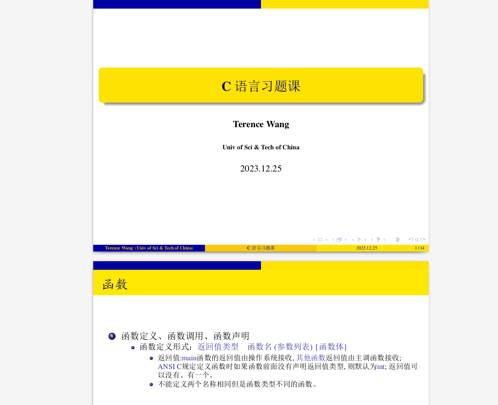

<!-- 




 -->

Hello, welcome to **Yu Wang**'s homepage. I am a junior student of [USTC(University of Science and Technology of China)](https://en.ustc.edu.cn/), majoring in **CS(computer science)** now. My Chinese name is **王昱** while my English name is **Terence**, so you can call me **Terence Wang**.

My research interest includes *Recommendation* and *LLM4Rec*. But actually, I haven't figured out what I am passionate about(Hope to find it one day).

# 💻 Research Experience

- *2023.03~Now*: Undergraduate Intern of [LDS](https://data-science.ustc.edu.cn/_upload/tpl/12/e9/4841/template4841/index.html) lead by [Xiangnan HE](https://hexiangnan.github.io/).
  - During this internship, I focus myself on *LLM4Rec*. I have read tens of papers relevant to *LLM4Rec*, and reproduced several papers with codes. What's more, I am doing some research on an *idea* now.

# :teacher: Teaching Experience

- *2023.09~2024.01*: Teaching Assistant for C language course
  - help freshmen master how to program with C language and teach them some basic data structures such as array, list and so on.

recitation lecture note
 

# 🎖 Honors and Awards

- *2023*: Outstanding Student Scholarship Grade 2
- *2022*: Yang Yongman Scholarship, HuaXia Computer Science Talent Class Scholarship
- *2021*: Outstanding Freshman Scholarship Grade 3.

# 📖 Education

- *2021.09~2025.06(expected)*, Bachelor in Computer Science in USTC. GPA/Percentage: 3.90/5.2%.

# 🔥 News
- *2023.09*: &nbsp;🎉🎉 I take TOEFL test for the first time. (Preparing for TOEFL is really tough for me, since I'm not that good at English.)
- *2023.03*: &nbsp;🎉🎉 I become an undergraduate intern of [LDS](https://data-science.ustc.edu.cn/_upload/tpl/12/e9/4841/template4841/index.html) lead by [Xiangnan HE](https://hexiangnan.github.io/) .

# 📝 Publications 

I am not that talented so I haven't published a paper. But I firmly believe that in the near future I will publish a paper. 💪💪💪

<!-- 

CVPR 2016

 -->

<!-- [Deep Residual Learning for Image Recognition](https://openaccess.thecvf.com/content_cvpr_2016/papers/He_Deep_Residual_Learning_CVPR_2016_paper.pdf)

**Kaiming He**, Xiangyu Zhang, Shaoqing Ren, Jian Sun

[**Project**](https://scholar.google.com/citations?view_op=view_citation&hl=zh-CN&user=DhtAFkwAAAAJ&citation_for_view=DhtAFkwAAAAJ:ALROH1vI_8AC) <strong></strong>
- Lorem ipsum dolor sit amet, consectetur adipiscing elit. Vivamus ornare aliquet ipsum, ac tempus justo dapibus sit amet. 

- [Lorem ipsum dolor sit amet, consectetur adipiscing elit. Vivamus ornare aliquet ipsum, ac tempus justo dapibus sit amet](https://github.com), A, B, C, **CVPR 2020** -->

